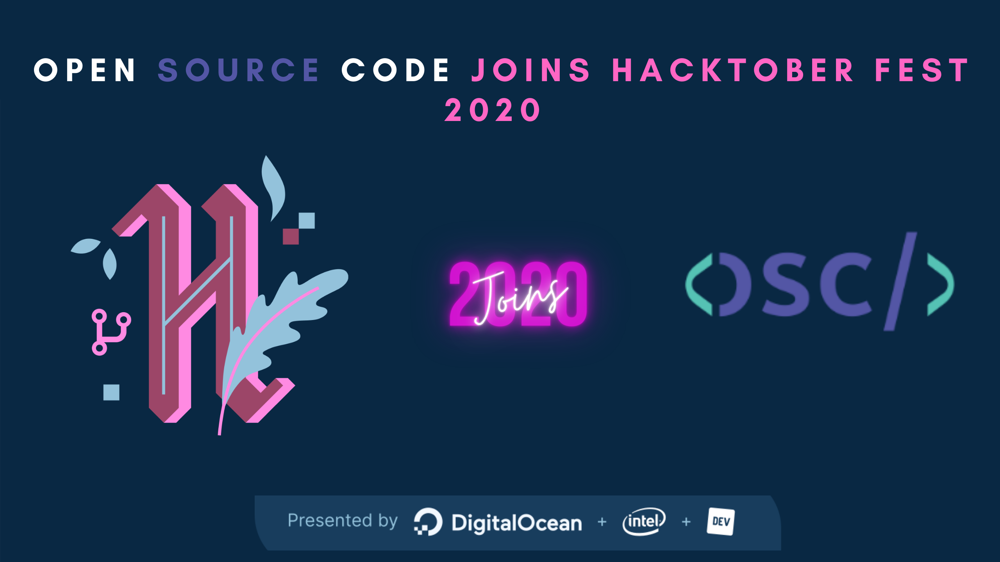

# Hacktoberfest2020---É um projeto muito bom e você pode ganhar uma camiseta.

Faça seu primeiro Pull Request e ganhe uma camiseta grátis no GitHub!




<p align="center">
   </a>
   </a>
   </a>
   </a>
</p>
# Welcome to GitHub!

## Este projeto é perfeito para fazer seu primeiro pull request

## Instruções

- Faça um fork do repositório clicando no botão fork no canto superior
- Clone o repositório 'forkado' (`git clone url_do_seu_repositorio_fork`)
- Crie uma nova branch e faça suas modificações (ex.: `git branch new-user` e faça checkout nessa branch `git checkout new-user` depois `git checkout -b new-user`)
- Adicione uma imagem de perfil na pasta `static/images/` (use a opção drag and drop ou faça upload pelos comandos.)
- Adicione seus dados pessoais na pasta `content/participant/`
- Adicione seus arquivos no git (`git add -A`), faça commit desses arquivos (`git commit -m "added myself"`) depois faça push (`git push origin new-user`)
- Crie uma solicitação de pull request
- Dê uma estrelinha ao repositório (star)

# Como fazer seu primeiro pull request

Onde estiver `<YOUR-USERNAME>` troque para seu usuário github neste guia.

## 1. Adicione sua imagem de perfil na pasta a seguir

Adicione uma imagem de sua escolha na pasta `static/images/`. Formatos aceitos são **png** e **jpg**, a imagem deve ter um tamanho minimo de 544x544 pixels. 

Ex.:
```
static/images/<YOUR-USERNAME>.png
```

_Esteja ciente que essa imagem irá aparecer no anuário!_

## 2. Adicione suas informações pessoais.

Crie um arquivo de marcação a partir da convenção na seguinjte pasta `content/participant/<YOUR-USERNAME>.md`. Ex.

```
content/participant/<YOUR-USERNAME>.md/
```

## 3. Copie o template a seguir para seu arquivo e altere os exemplos para seus dados pessoais.

```
---
name: YOURNAME
institution: INSTITUTION_NAME
github:USERNAME
---
```

_Não utilize caracteres especiais no exemplo acima._

## 4. Aguarde seu pull request ser mergiado.

## 5. Comemore!! Você acaba de fazer seu primeiro pull request!!
